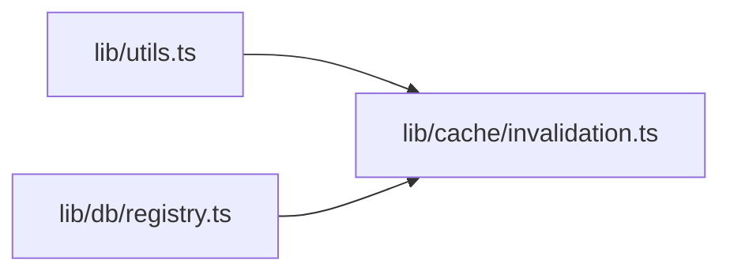

# CodeStats -- Code Intelligence CLI

> Copy this file to `.claude/skills/codestats/SKILL.md` in any project to give Claude Code access to codestats capabilities.

## Installation Check

Before using any codestats command, verify it is installed:

```bash
codestats --version
```

If the command is not found, install it:

```bash
pip install codestats
```

Or install from source before PyPI availability:

```bash
pip install git+https://github.com/Abdo-El-Mobayad/codestats.git
```

Requires Python 3.10+ and git available on PATH.

## What CodeStats Does

CodeStats builds a dependency graph of a codebase using tree-sitter parsing and git history analysis, then answers four questions:

1. **Dead code detection** -- Find files that nothing imports. Useful for identifying cleanup opportunities and reducing maintenance burden. Framework-aware: Next.js pages, routes, layouts, and middleware are never flagged.

2. **Blast radius / risk analysis** -- For any given file, show how many other files depend on it (importers), what it depends on, its PageRank centrality score, git churn, hotspot status, and co-change partners. Essential before refactoring high-coupling files.

3. **Dependency path tracing** -- Find the shortest import chain between two files. Useful for understanding how changes propagate and why two seemingly unrelated files are coupled.

4. **Architecture diagrams** -- Generate Mermaid flowcharts of the dependency graph, ranked by centrality. Useful for onboarding, documentation, and identifying architectural patterns.

## Concepts Explained

### Internal vs External Edges

An **internal edge** is an import between two files within the repository (e.g., `lib/sync/scheduler.ts` imports `lib/cache/invalidation.ts`). An **external edge** is an import of a third-party package (e.g., `import pg from 'pg'`). CodeStats tracks both but most commands focus on internal edges since those represent coupling within your control.

### PageRank Centrality

PageRank measures which files are most "load-bearing" in the codebase. A file with high PageRank is imported by many files that are themselves highly imported. Think of it as recursive importance. A file like `lib/utils.ts` with 65 importers will have high PageRank. Changing a high-PageRank file carries more risk because breakage cascades further.

### Hotspot Scoring

A **hotspot** is a file with high recent churn (many lines added/deleted in the last 90 days) combined with temporal decay weighting (recent commits matter more than old ones). Hotspots are files that are both important and actively changing -- the highest risk combination. The hotspot score ranges from 0.0 to 1.0.

### Blast Radius

The **blast radius** of a file is the number of files that directly import it (its importer count). A file with 45 importers has a much larger blast radius than one with 2. When you change a file's exports, function signatures, or behavior, every importer is potentially affected. Always check blast radius before refactoring.

### Dead Code

A file is flagged as **dead code** when it has zero importers (nothing in the codebase imports it) and it is not a recognized entry point. Framework entry points (Next.js pages, routes, layouts, middleware), config files, test fixtures, migration files, and type declaration files are automatically excluded from dead code detection.

**Confidence scores** range from 0.0 to 1.0 based on factors like git activity (recently modified files get lower confidence since they may be works in progress) and file type.

The **safe_to_delete** flag is true when the file has zero importers, no recent git activity, and is not a recognized entry point or config file.

## Command Reference

### `codestats init [PATH]`

Index the project. Must be run before any other command. Re-run to update the index after significant changes.

```bash
# Index the current directory
codestats init

# Index a specific project
codestats init /path/to/project

# Verbose mode (shows per-file progress)
codestats init --verbose
```

**What it does:** Traverses files (respecting .gitignore), parses each with tree-sitter to extract imports and symbols, builds a NetworkX dependency graph, mines git history for churn and hotspots, runs dead code detection, and saves everything to `~/.codestats/projects/<repo>/graph.db`.

**Typical timing:** ~3 minutes for a 400-file codebase. The majority of time is spent on git log analysis.

**When to run:**

- First time using codestats on a project
- After major refactoring, file renames, or dependency changes
- Periodically (weekly or before important refactoring decisions)

### `codestats dead-code [PATH]`

List files with zero importers that are not framework entry points.

```bash
# Show all dead code findings
codestats dead-code

# JSON output for scripting
codestats dead-code --json

# Only high-confidence findings
codestats dead-code --min-confidence 0.7
```

**Example output:**

```
Dead code findings: 71

File                                                         Kind                  Conf Safe?
-----------------------------------------------------------------------------------------------
components/ui/collapsible.tsx                                unreachable_file      0.85   Yes
lib/stores/dashboard-store.ts                                unreachable_file      0.80   Yes
```

**How to interpret:**

- **Kind**: `unreachable_file` means no file imports it. `unused_export` means specific exported symbols are never imported. `zombie_package` means an npm package is in package.json but never imported.
- **Conf**: Confidence from 0.0-1.0. Higher means more likely truly dead.
- **Safe?**: "Yes" means it is safe to delete based on zero importers and no recent activity.

**When to use:**

- Periodic codebase cleanup
- Before a major release to reduce bundle size
- When onboarding to understand what is and is not actively used

### `codestats risk FILE [PATH]`

Show blast radius, centrality metrics, git analytics, and co-change partners for a specific file.

```bash
# Check risk for a specific file
codestats risk lib/db/registry.ts

# JSON output
codestats risk lib/db/registry.ts --json
```

**Example output:**

```
Risk Analysis: lib/db/registry.ts

  Language:       typescript
  Symbols:        12
  Entry Point:    No
  PageRank:       0.008432
  Betweenness:    0.045210

  Importers (45):
    <- lib/sync/airtable.ts
    <- lib/sync/scheduler.ts
    <- lib/sync/exchange-rates.ts
    ... and 42 more

  Dependencies (3):
    -> lib/helpers/url-helpers.ts

  Git Analytics:
    Commits (total):  18
    Commits (90d):    5
    Hotspot:          Yes (score: 0.72)
    Primary owner:    Abdo
    Bus factor:       1
```

**How to interpret:**

- **Importers (N)**: N files directly import this file. This is the blast radius. 45 importers = high risk to change.
- **PageRank**: Higher = more central to the codebase. Files above 0.005 are significant.
- **Betweenness**: Higher = this file sits on more shortest paths between other files. It is a bottleneck.
- **Hotspot score**: 0.0-1.0. Above 0.5 means actively churning. Combined with high importer count, this is the riskiest pattern.
- **Bus factor**: Number of unique committers. 1 = single point of failure for knowledge.

**When to use:**

- Before refactoring any file -- understand what depends on it
- When deciding whether to split a large file
- When assessing risk of a proposed change

### `codestats deps FROM TO [PATH]`

Find the shortest import chain between two files using BFS.

```bash
# Find how scheduler.ts reaches invalidation.ts
codestats deps lib/sync/scheduler.ts lib/cache/invalidation.ts

# JSON output
codestats deps lib/sync/scheduler.ts lib/cache/invalidation.ts --json
```

**Example output:**

```
Dependency path (1 hops):

  lib/sync/scheduler.ts
  -> lib/cache/invalidation.ts
```

**How to interpret:**

- The path shows the import chain from source to target.
- Fewer hops = tighter coupling. 1 hop means direct import.
- If no path is found, the files are in disconnected parts of the graph.

**When to use:**

- Understanding why a change in file A broke file B
- Investigating coupling between modules
- Planning how to decouple two subsystems

### `codestats diagram [PATH]`

Generate a Mermaid flowchart of the dependency graph. Output goes to stdout.

```bash
# Generate diagram of top 100 files
codestats diagram

# Smaller diagram (top 20 most central files)
codestats diagram --max-nodes 20

# Save to file
codestats diagram > architecture.mmd

# JSON output (nodes + edges arrays)
codestats diagram --json
```

**Example output:**



**When to use:**

- Generating architecture documentation
- Onboarding new team members
- Visualizing module boundaries

### `codestats status [PATH]`

Show a summary of the last index.

```bash
codestats status
codestats status --json
```

**Example output:**

```
CodeStats Status: quill

  Repository:     D:\Github\quill
  Indexed at:     2026-04-08T03:32:00
  Files:          400
  Internal edges: 1033
  Hotspots:       99
  Dead code:      71
  Database:       C:\Users\You\.codestats\projects\quill\graph.db (392.0 KB)
```

**When to use:**

- Checking when the index was last updated
- Quick health overview of codebase complexity

## Best Practices

### Before Refactoring a File

Always check blast radius first:

```bash
codestats risk <file-to-refactor>
```

If the importer count is high (>20), consider:

- Making changes backward-compatible
- Adding a new interface alongside the old one, migrating consumers, then removing the old one
- Breaking the file into smaller, more focused modules

### Periodic Cleanup

Run dead code detection regularly to find files that can be safely removed:

```bash
codestats dead-code --min-confidence 0.7
```

Focus on high-confidence findings first. Review lower-confidence findings manually -- they may be dynamically loaded or used via reflection.

### After Major Changes

Re-index after significant refactoring, file renames, or dependency changes:

```bash
codestats init
```

The index does not auto-update. If results seem stale or unexpected, re-indexing is the fix.

### Investigating Coupling

When two modules seem too tightly coupled, trace the dependency path:

```bash
codestats deps <module-a-file> <module-b-file>
```

If the path is short (1-2 hops) and involves many files, consider introducing an interface or event system to decouple them.

### Architecture Reviews

Generate a diagram before architecture discussions:

```bash
codestats diagram --max-nodes 30 > architecture.mmd
```

The Mermaid output can be pasted into GitHub markdown, rendered with the Mermaid CLI, or viewed in any Mermaid-compatible viewer.

## How Storage Works

All data is stored globally at:

```
~/.codestats/
  projects/
    <repo-name>/
      graph.db          # SQLite database with graph, git metadata, dead code findings
```

The repo name is auto-detected from the git remote URL (`origin`). If no remote is configured, the directory name is used. No files are written to the project directory.

The SQLite database contains four tables:

- `graph_nodes` -- file paths with language, symbol count, PageRank, betweenness
- `graph_edges` -- import relationships between files
- `git_metadata` -- commit counts, churn, hotspot scores, ownership per file
- `dead_code` -- dead code findings with confidence and safety flags

Database size is typically small (under 1 MB for a 400-file project).

## Troubleshooting

**Results seem stale or wrong:** Re-index with `codestats init`. The database is not updated automatically when files change.

**"Project not indexed yet" error:** Run `codestats init` from the project directory first.

**"Not a git repository" error:** CodeStats requires a git repository. Ensure the directory has been initialized with `git init` and has at least one commit.

**File not found in index:** The file path must match exactly as stored (forward slashes, relative to repo root). Run `codestats status --json` to verify the index exists, then check the file path.

**Next.js pages showing as dead code:** This should not happen -- Next.js entry points are automatically excluded. If it does, re-index with `codestats init`. If the issue persists, the file may not match the expected patterns (e.g., it is outside the `app/` or `pages/` directory).

**Slow indexing:** The git analytics step is the slowest part, as it runs `git log` per file. On a 400-file codebase, expect about 3 minutes total. Larger codebases will take proportionally longer.

**Missing language support:** CodeStats supports TypeScript, JavaScript, Python, Go, Rust, Java, C, C++, Kotlin, and Ruby. Files in other languages are traversed but not parsed for imports.
